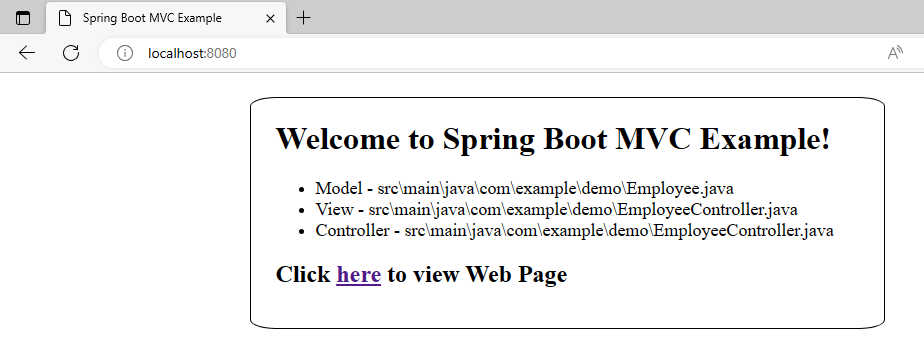
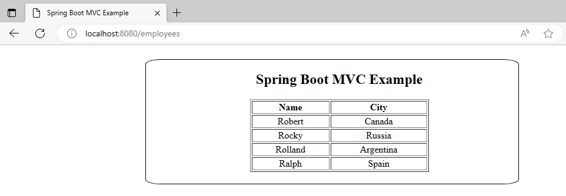

### Spring Boot Demo 1B MVC Example

**Steps:**
<ol>
<li>To setup IDE for Spring project, follow steps in https://github.com/worldpeacez0991/SpringBoot_demo1</li>

<li>Start Spring Boot App
<ul>
<li>Via Spring IDE, open 'DemoApplication.java', press 'Alt+Shift+X, B', to start 'Spring Boot App' 
This shows how to use Spring Boot to create a MVC web page.</li> 
</ul>
</li>

 
<li>Via browser, type 'http://localhost:8080', to view home page.</li>
<kbd></kbd> 

 
<li>Via browser, type 'http://localhost:8080/employees', to view 'employees' page.</li>
<kbd></kbd> 

 
Credits: https://spring.io/team 
Source: http://www.masterspringboot.com/web/developing-web-applications/creating-an-mvc-application-using-spring-boot/ 

